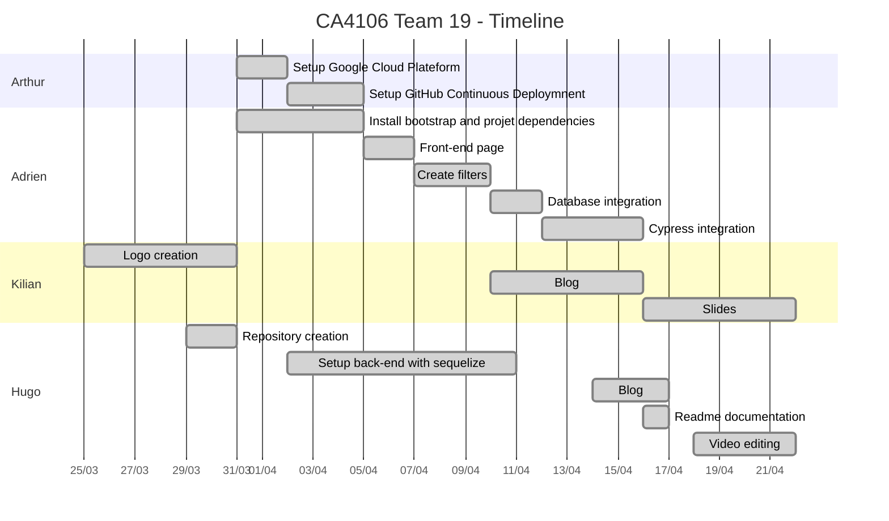

# CA4106 Cloud Computing - Project

Team 19:
* Adrien ZEMMA (adrien.zemma2@mail.dcu.ie)
* Arthur MELIN (arthur.melin2@mail.dcu.ie)
* Hugo MARTIN (hugo.martin6@mail.dcu.ie)
* Kilian MAYANS (kilian.mayans2@mail.dcu.ie)

Git repository: [CA4106_Team19](https://github.com/Demmonius/CA4106_Team19)

---

## Summary
* Introduction
* Technical informations
* Project timeline
* References
* Mockups
* Project progress
* Researches / Tools

---

# Introduction
The goal of this project is to create front website, looking for data in a database.
In order to demonstrate this workflow, we created a website showing movies and informations about it. You can search movies and get informations like:
* Name
* Plot
* Release date
* Genre
* Director
* Writer

# Technical informations
In order to start the project locally or if you want to know how to run unit tests, please take a look at this [README](./README.md).

# Project timeline
Start of the project: March 25st, 2020
End of the project: April 22th, 2020
Deadline of the project: April 24th, 2020

We started working on the project by having a Discord meeting to discuss the details of the project, such as splitting task among ourselves and choosing what kind of data to use in our website.

We came up with the following work distribution:
* Arthur: Backend, System and GCP Administration 
* Adrien: Frontend
* Hugo: Backend, Blog, Video
* Kilian: Blog, Slides

### Arthur
To begin with, I started by creating a Google Cloud Platform account and setting up billing with my credit card to unlock the $300 free credit.
I created a new project to host all the resources of the project and invited the other members of the group in the project.

I then attempted 3 times to create an instance of a MySQL Cloud SQL database, however, but the operation failed everytime with an unknown server error. I tried troubleshooting the problem by shutting down and recreating the project thinking it was related to the `mail.dcu.ie` organisation permissions.
It turned out that at the same time we started working, Cloud SQL services were suffering a [global incident](https://status.cloud.google.com/incident/zall/20004) that prevented me from creating the instances. This incident was resolved later in the day.

In the meantime, I created the App Engine application, and downloaded, installed and set up the GCloud SDK on my computer.
I also read the following guides on how to setup a Node.js application server in the context of App Engine, as well as checked out the Hello World sample from Google:
* [Quickstart for Node.js in the App Engine Standard Environment](https://cloud.google.com/appengine/docs/standard/nodejs/quickstart?hl=en_GB)
* [Setting up a Node.js development environment](https://cloud.google.com/nodejs/docs/setup)
* [Node.js in App Engine Hello World sample](https://github.com/GoogleCloudPlatform/nodejs-docs-samples/tree/master/appengine/hello-world/standard)

I created the source code folder structure in the repository and copied some of the code from the Hello World sample to have a minimal application to test and deploy.

I read the following guide to setup the deployment on App Engine and created the `app.yaml` file:
* [Defining Runtime Settings](https://cloud.google.com/appengine/docs/standard/nodejs/configuring-your-app-with-app-yaml)

Once everything was ready, I attempted to deploy the Hello World application to App Engine and everything worked:

After the issue with Google Cloud SQL was resolved, I created the MySQL server instance and the database.

I read a guide to setup the connection with our application, but since we wanted to use the Object-Relational Mapping (ORM) library *Sequelize* to access database objects instead of writing SQL queries by hand, I ended up having to look up this library's documentation and figure out the configuration on my own.
* [Connecting to Cloud SQL from App Engine](https://cloud.google.com/sql/docs/mysql/connect-app-engine)
* [Sequelize - API Reference - Connection creation](https://sequelize.org/v5/class/lib/sequelize.js~Sequelize.html#instance-constructor-constructor)

Finally, in order for Adrien to be able to work on the project from his computer, I had to give him access to the database by adding his IP to the allowed network whitelist in the Connections settings of the Cloud SQL instance.

Next, as suggested by Hugo, I worked on setting up Continuous Deployment using GitHub Actions. That is, automatically deploying the application to App Engine whenever someone pushes to the `master` branch of the Git repository. This required creating a Service Account in the Google Cloud project and granting it the required permissions. I used the following guide:
* [Connecting GitHub Actions to Google App Engine](https://medium.com/@fleker/connecting-github-actions-to-google-app-engine-ba85072b57c9)

### Adrien 
After a talk with the team we decided to use 4 different technologies:
 * [Pugs-js](https://pugjs.org/) as the main technology as front-end renderer
 * [Bootstrap](https://getbootstrap.com/) for the styling

I've take in charge the front-end of the project. It was the first time I used *pug* i've learn a lot from ["the getting started guide"](https://pugjs.org/api/getting-started.html). As a first version i just setup bootstrap while waiting for Hugo to setup *Sequelize*.Then I create a simple UI with barely no style or feature. One's the UI ready i've add some feature like pagination and modal that give more information about the movies. 
Thanks to my technical background I already now how to use most of the above technologie so I don't have to make extensive reasearch.

### Hugo
After the initial talk, I started working on the project by creating the git repository on github.

Next, I used:
 * [Express-js](https://expressjs.com/fr/) for the back end 
 * [Sequelize](https://sequelize.org/) for the interaction with the SQL database
 * [docker-compose](https://docs.docker.com/compose/) to stgart many docker images

About the video editiong, I used Adobe Premiere Pro which allowed me to put together all of our clips. It was really long because it's only a hobby, not a job I want to apply. So I needed to learn and figure about hard problems.

